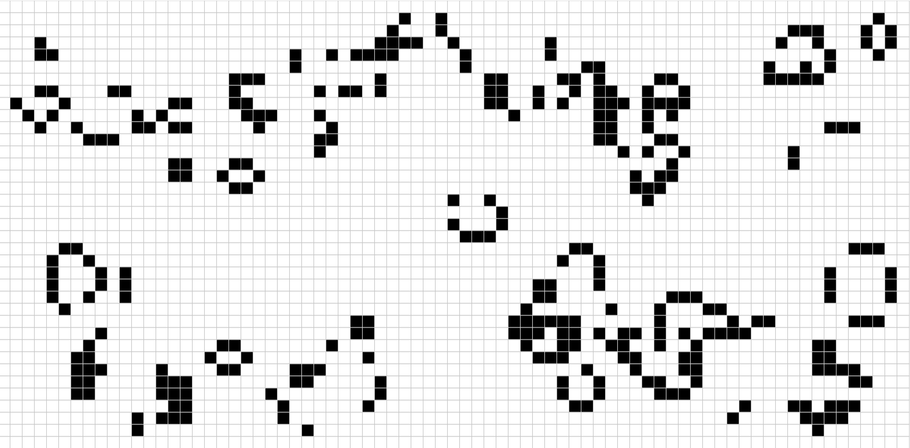

# The Game of Life - Browser Edition
An implementation of John Conway's "Game of Life" cellular automaton in the browser using JavaScript and p5.js.
[Click here to try it!](https://zgell.github.io/game-of-life-js/)

This project is a work-in-progress, as it is my first web app. My motivation for making this was simply as an exercise to branch out into web programming, as well as improve upon a previous project of mine.
I have made [an implementation of the Game of Life in Python](https://github.com/Zgell/game-of-life-python), but I always felt that it wasn't interactive enough. I plan on making this version far more interactive and enjoyable for the user to play around with. I also want to host this app online through GitHub Pages so that anyone can use it without any installation.

Tentative list of future features and bugfixes:
- Add some images to the HTML to show off some common shapes that users could draw so they can play around with them.
    - Preferably, a way to easily copy/paste different structures into the grid would be great.
- Reposition canvas so it's in the center of the page (may need CSS).
- Add ability to load specific examples? (ie. glider guns)
- ~~Add indicator to show whether simulation is paused or not~~
- Night mode?
- Investigate whether or not it's possible to resize the board using a slightly different class implementation? Is it possible to make some kind of resizable matrix to use for the board?
- Add a check when players are manually switching cells so that they can't override cells on the boundary, it causes glitchy behaviour